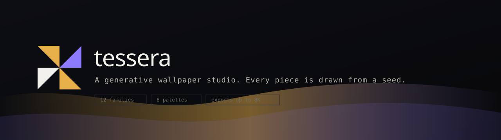

<p align="center">
  
</p>

<h1 align="center">Tessera</h1>

<p align="center">
  A generative wallpaper studio. Tessera does not store images, it draws them.
  Pick a family and a palette, shape the composition, then export a pixel perfect
  wallpaper for any phone, tablet or desktop.
</p>

<p align="center">
  <a href="#license"></a>
  
  
  
  
  
</p>

<p align="center">
  <a href="https://tessera-wallpapers.vercel.app">Live demo</a>
  &nbsp;&middot;&nbsp;
  <a href="#the-studio">Studio</a>
  &nbsp;&middot;&nbsp;
  <a href="#how-the-engine-works">How it works</a>
  &nbsp;&middot;&nbsp;
  <a href="#deploy">Deploy</a>
</p>

<p align="center">
  <a href="https://vercel.com/new/clone?repository-url=https%3A%2F%2Fgithub.com%2FAbudora-0%2Ftessera">
    
  </a>
</p>

---

## Why Tessera

Most wallpaper sites are heavy galleries of other people's photos, gated behind
sign ups and ad walls, and the one image you like is never the right size for
your screen. Tessera holds no images at all. It holds a drawing engine.

Every wallpaper is a pure function of a seed. Change the seed and you get a new
composition. Ask for a 4K desktop or a tall phone screen and the engine redraws
at exactly that size. The result downloads straight from your browser with no
backend involved.

## Features

- **Twelve drawing families.** Aurora, Mesh, Flow, Strata, Tessellate, Orbital,
  Waveform, Bauhaus, Halftone, Terrazzo, Ripple and Marble, each a different
  algorithm for filling a frame.
- **Eight colour palettes.** From Midnight and Ice to Ember and Neon, tuned by hand.
- **The Studio.** Live preview with themed controls for density, contrast, detail,
  turbulence and grain. Roll the seed until a piece stops you.
- **Discover.** A separate section that searches real wallpapers live across
  Unsplash, Pexels, Pixabay, Wallhaven, NASA and Reddit wallpaper subreddits,
  with author, source and licence on every result.
- **Exact device exports.** Presets for phones, tablets and desktops up to 5K,
  plus any custom size. Renders off screen at native resolution, up to 8192 pixels
  on the long edge.
- **Shareable by link.** A wallpaper is fully described by its URL, for example
  `/studio?f=aurora&p=ember&s=1042`.
- **Command palette.** Press <kbd>Cmd</kbd> or <kbd>Ctrl</kbd> + <kbd>K</kbd> to
  jump anywhere or roll a surprise.
- **A local shelf.** Save favourites to the browser with no account.
- **Themed to the last pixel.** Custom scrollbar, animated logo, count up stats,
  custom dropdowns and sliders, all part of the same object.
- **Keyboard first in the Studio.** <kbd>R</kbd> rolls the seed, <kbd>Shift</kbd> +
  <kbd>R</kbd> rolls everything, <kbd>F</kbd> cycles the family, <kbd>D</kbd>
  downloads.
- **Respects `prefers-reduced-motion`** and ships as a fast static site.

## The Studio

The Studio is the heart of Tessera. It exposes the full parameter space of the
engine through controls that match the mosaic theme:

| Control      | What it changes                                             |
| ------------ | ---------------------------------------------------------- |
| Family       | The drawing algorithm                                      |
| Palette      | The colour story the algorithm samples from                |
| Seed         | The deterministic starting point                           |
| Density      | How many marks the generator lays down                     |
| Contrast     | Separation between light and dark                          |
| Detail       | Structural complexity of the composition                   |
| Turbulence   | Warp and movement in the field                             |
| Grain        | Film grain layered on top                                  |
| Device       | Desktop, mobile or tablet resolution presets, or a custom size |

## Discover

Discover is a separate section (`/discover`) that pulls real wallpapers live from
third party APIs and normalizes every result into one shape. Each source is an
adapter in `src/lib/sources/`; API route handlers in `src/app/api/discover/` call
them and return JSON with a cursor for infinite scroll. Downloads are streamed
through `src/app/api/download/` so the filename and attachment header are ours
and Unsplash's download ping is honoured.

| Source | Licence | Key |
| ------ | ------- | --- |
| Unsplash | Unsplash License | `UNSPLASH_ACCESS_KEY` |
| Pexels | Pexels License | `PEXELS_API_KEY` |
| Pixabay | Pixabay Content License | `PIXABAY_API_KEY` |
| Wallhaven | Uploader owned | `WALLHAVEN_API_KEY` (optional, SFW works without) |
| NASA | Public domain | none |
| Reddit | Rights retained by original creators | `REDDIT_CLIENT_ID`, `REDDIT_CLIENT_SECRET`, `REDDIT_USER_AGENT` |

Copy `.env.example` to `.env.local` and add the keys you have. Any source without
a key is simply disabled in the UI; the rest of the site is unaffected. Mature
content is filtered out by default and only affects Reddit and Wallhaven when
turned on. Reddit images are posted by users and are mostly copyrighted works, so
Discover shows the author and links back to the original post; check the source
before reusing anything commercially.

## How the engine works

```
seed ──► mulberry32 PRNG ──► generator.draw({ ctx, width, height, palette, rng, params })
                                     │
                          Canvas 2D composition
                                     │
     preview  ◄───────────────────────┴───────────────────────►  full resolution export
   (in viewport, capped)                                     (offscreen canvas, toBlob, PNG)
```

1. The seed, family and palette are hashed into a 32 bit integer.
2. A seeded `mulberry32` generator drives every random choice, so the output is
   fully deterministic.
3. The chosen generator paints onto a `CanvasRenderingContext2D`. Generators avoid
   per pixel loops, so the same code runs for a 320 pixel thumbnail and an 8K export.
4. Exports render on a detached canvas at the target resolution and are encoded to
   a PNG blob in the browser.

## Tech stack

| Area        | Choice                                                          |
| ----------- | ------------------------------------------------------------- |
| Framework   | Next.js 16 App Router, static output, React Server Components |
| Language    | TypeScript in strict mode                                     |
| Rendering   | Canvas 2D, no WebGL dependency                                |
| Animation   | Motion for interface transitions and scroll reveals          |
| Styling     | Tailwind CSS v4 with design tokens                            |
| State       | Zustand, persisted to the browser for theme and the shelf    |
| Noise       | `simplex-noise` for flow fields and topographic layers       |
| Discover    | Node route handlers proxying third party image APIs          |

## Getting started

```bash
git clone https://github.com/Abudora-0/tessera.git
cd tessera
npm install
cp .env.example .env.local   # optional, for the Discover section
npm run dev
```

Open `http://localhost:3000`. The generative Studio and Gallery need no
configuration; only Discover reads the keys in `.env.local`.

### Scripts

| Script          | Purpose                       |
| --------------- | ---------------------------- |
| `npm run dev`   | Start the dev server          |
| `npm run build` | Production build              |
| `npm run start` | Serve the production build    |
| `npm run lint`  | Run ESLint                    |

## Project structure

```
src/
  app/
    (routes)           home, gallery, studio, discover, wallpaper/[slug], about
    api/discover/      search + single item route handlers
    api/download/      streams a source image as an attachment
  components/
    discover/          the Discover browser, cards, detail and download panel
    ...                logo, cursor, command palette, themed controls, canvases
  lib/
    prng.ts            Seeded random and human friendly seed labels
    palettes.ts        Palette definitions and colour helpers
    devices.ts         Device and resolution presets
    generators/        The twelve drawing families and shared helpers
    render.ts          Canvas orchestration, export, URL encoding
    sources/           One adapter per external wallpaper source
  data/
    collections.ts     Curated presets shown in the gallery
  store/
    useStore.ts        Theme, the local shelf and saved photos
```

## Adding a family

1. Add a generator to `src/lib/generators/families.ts` that implements the
   `Generator` interface.
2. Register it in the `GENERATORS` array.
3. It appears automatically in the Studio, the gallery filters and the command palette.

## Deploy

Tessera is a static Next.js app and needs no configuration to run on Vercel.

1. Push the repository to GitHub.
2. Import it at [vercel.com/new](https://vercel.com/new).
3. Accept the defaults and deploy.

Or use the one click button at the top of this file.

## Topics

`wallpapers` `generative-art` `creative-coding` `canvas` `nextjs` `react`
`typescript` `tailwindcss` `design-tools` `procedural-generation` `wallpaper-generator`
`vercel`

## Contributing

Issues and pull requests are welcome. The engine is small on purpose, so a new
family or palette is a good first contribution.

## License

Released under the [MIT License](LICENSE).
